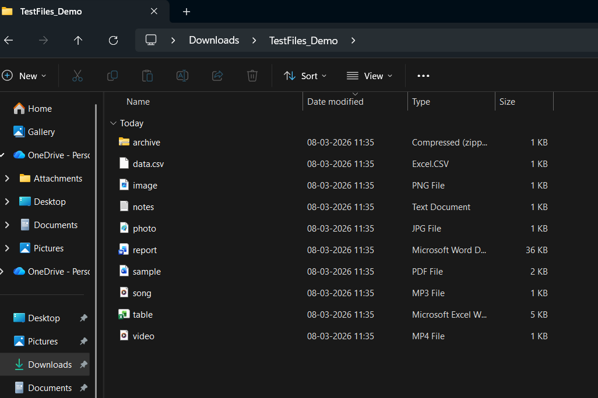
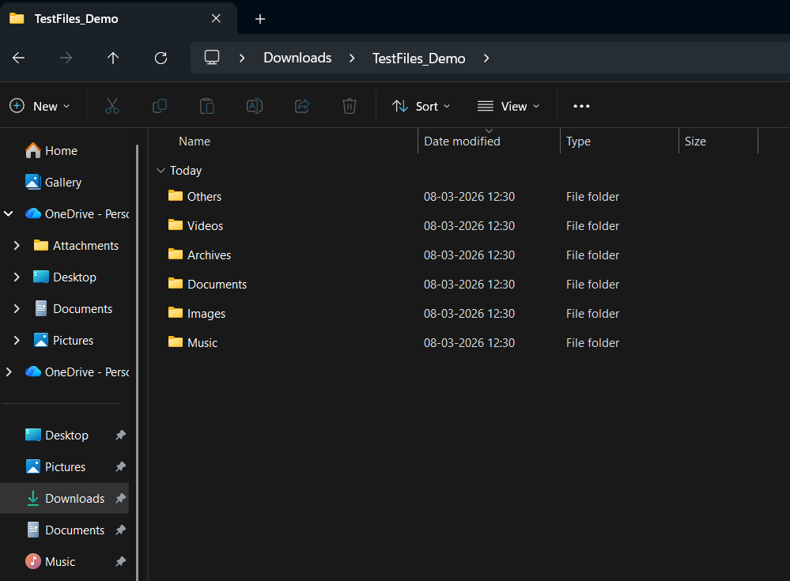

# AI File Organizer Agent

This project automatically organizes files in a folder based on file type.

## Features

- Scans folder for files
- Detects file type
- Creates folders automatically
- Moves files into correct categories

## Run the Project

Install requirements

pip install -r requirements.txt

Run the app

streamlit run app.py

## Project Output

### Before Organizing Files

### Running the Script

### After Organizing Files

## 🚀 Live Demo

Click here to use the application:

[AI File Organizer Agent](https://ai-file-organizer-agent-b9hcagmcwa8wzc7pkfjgak.streamlit.app/)
